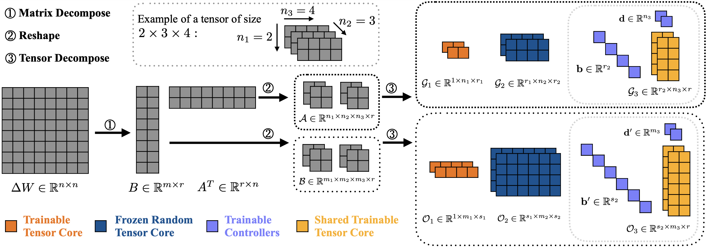

<p align="center">
  
</p>

# TRAC: Tensor-Train based Across-layer Compression for Parameter-Efficient Fine-Tuning

This is the official implementation repository for the paper **"TRAC: Tensor-Train based Across-layer Compression for Parameter-Efficient Fine-Tuning"**, accepted to **ICLR 2026**.

## Abstract

*Fine-tuning large pre-trained models under resource constraints remains challenging due to the massive number of parameters involved. Existing parameter-efficient tuning methods, such as low-rank adaptation (LoRA) and its variants, rely heavily on matrix factorization and often struggle in extremely low-parameter regimes. In this work, we propose TRAC, a novel fine-tuning framework that leverages **T**ensor-T**r**ain decomposition with **A**cross-layer **C**ompression. Specifically, TRAC represents each adaptation module as a compact sequence of tensor-train cores and allows certain cores to be frozen or shared across layers, thereby exploiting the inherent similarity and redundancy among layer weight matrices. To retain layer-specific flexibility, lightweight controllers are introduced, enabling shared tensor cores to adaptively modulate representations. We evaluate TRAC on diverse architectures, including Qwen, LLaMA, GPT, BERT, and ViT, across benchmarks covering text classification, text generation, and image classification. Experimental results demonstrate that TRAC achieves performance comparable to or better than LoRA and its variants, while substantially reducing trainable parameters and storage requirements.* 

### Method Overview

*(Note: If your browser does not render PDF images, please download `trac_overview.pdf` to view the detailed method illustration.)*

---

## Usage

Using TRAC is highly similar to using standard PEFT methods like LoRA. You can easily integrate it into your existing Hugging Face `transformers` workflow.

### General Example

```python
from transformers import AutoModelForSequenceClassification
from trac import TracConfig, get_peft_model

# 1. Load base model
model = AutoModelForSequenceClassification.from_pretrained("roberta-base")

# 2. Define TRAC configuration
config = TracConfig(
    r=16,
    lora_alpha=32.0,
    target_modules=['query', 'value'],
    hidden_size=768,
    mlp_hidden_dim=3072,
    lora_dropout=0.05,
    task_type='SEQ_CLS',
    vector_activation='softmax'
)

# 3. Get TRAC-adapted model
model = get_peft_model(model, config)

# Now you can train `model` using your standard training loop!
```

### Customizing Tensor Structures & Hyperparameters

If you need to modify the tensor structure, tensor shapes, or other advanced hyperparameters, you can:

1. **Directly modify the default configurations** in `trac/tensor_cfg.py`.
2. **Explicitly pass them** as arguments when initializing `TracConfig`.

## Examples

We provide ready-to-use scripts to reproduce our experiments on BERT (GLUE benchmark) and ViT.

### 1. BERT on GLUE

To run the fine-tuning script for BERT models on GLUE tasks:

```bash
bash examples/bert/scripts/run_glue.sh
```

### 2. ViT on Image Classification

To run the fine-tuning script for Vision Transformers:

```bash
bash examples/vit/scripts/run_vit.sh
```

------

## Release Roadmap

- **April 2026:** Organize and release project environment requirements; optimize core `trac`, `bert`, and `vit` codebases with comprehensive comments.
- **May 2026:** Release running examples and reproduction scripts for additional model architectures (e.g., LLaMA, Qwen, GPT).
- **Long-term:** Continuously optimize the codebase, ensure compatibility with new model architectures, and provide ongoing bug fixes and maintenance.

------

## Citation

If you find our work useful, please consider citing our paper:

```bibtex
@inproceedings{
ye2026trac,
title={{TRAC}: Tensor-Train based Across-layer Compression for Parameter-Efficient Fine-Tuning},
author={Bangguo Ye and Yuanwei Zhang and Xiaoqun Zhang},
booktitle={The Fourteenth International Conference on Learning Representations},
year={2026},
url={https://openreview.net/forum?id=tz5yPWZp9W}
}
```

------

## Acknowledgements

Our code implementation is inspired by and built upon several excellent open-source projects. We sincerely thank the authors of:

- **PEFT**: https://github.com/huggingface/peft
- **LoRA**: https://github.com/microsoft/LoRA
- **LoRETTA**: https://github.com/yifanycc/loretta
- **SoRA**: https://github.com/TsinghuaC3I/SoRA
- **NoLA**: https://github.com/UCDvision/NOLA
